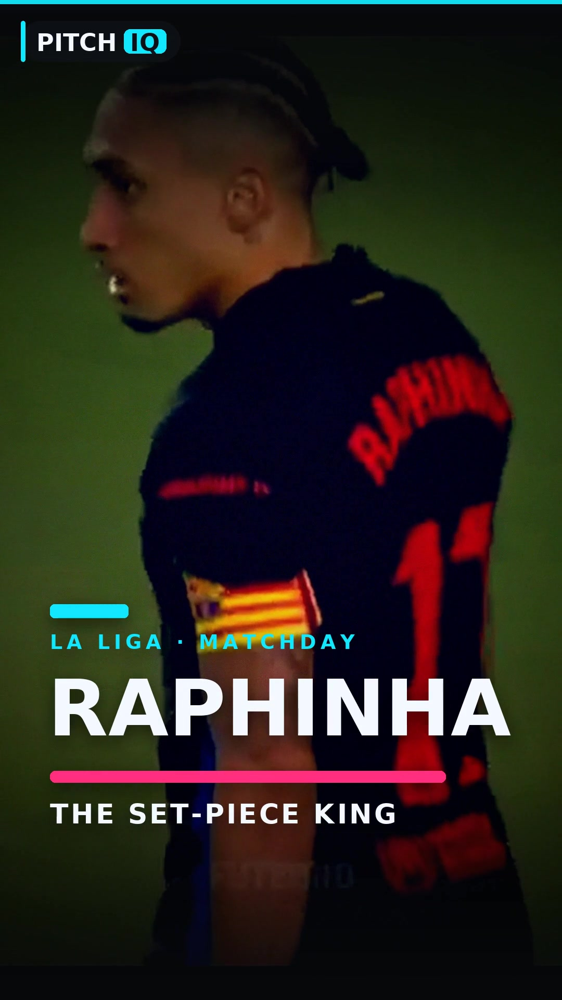

# Transformative Football Reel — "PITCH IQ" Edit

An original, heavily re-authored vertical reel produced from a reference
La-Liga highlight clip (Raphinha / FC Barcelona). The goal was **not** a copy:
the pipeline keeps only the general idea, pacing and emotional arc of the
reference and rebuilds everything else — structure, grade, graphics, motion,
branding and audio.

**Deliverable:** [`raphinha_transformative_reel.mp4`](raphinha_transformative_reel.mp4)
· 1080×1920 · 30 fps · H.264 / AAC · faststart · ~23 s · peak −0.3 dB (no clipping).



---

## 1. Reference analysis

| Attribute | Reference |
|---|---|
| Format | 360×640, 30 fps, ~29.7 s, audio peaking at **0.0 dB (clipping)** |
| Story | Raphinha set-piece → build-up play → yellow-card tension → goal payoff → hero shot |
| Graphics | Green/yellow name callouts with down-arrows, filled yellow spotlight circles, "YELLOW CARD" + "FUTEBRO" burned-in template |
| Grade | Flat broadcast look |
| Pacing | Slow open, montage bursts around 3 s / 15 s / 24 s |

## 2. What was transformed

| Dimension | Reference | This edit |
|---|---|---|
| **Structure** | Slow corner-kick open | **Cold hero hook + kinetic title card** first, then setup → build → tension → payoff → **CTA end card** |
| **Camera** | Static broadcast frames | Virtual camera on every shot — slow push-ins, a left parallax drift, punch-ins |
| **Speed** | Real-time | Near-freeze title/end card + a real **speed ramp** (normal approach → slow-mo strike) on the goal |
| **Transitions** | Hard cuts | Varied `xfade` — fade / smoothleft / wipeleft / smoothup / fadewhite, plus impact flashes |
| **Graphics** | Green arrows, filled circles, "FUTEBRO" | New **cyan / magenta / charcoal** system: pill lower-thirds, a cyan **tracking ring**, custom score chip, a "BOOKED" card, a "GOAL" burst, growing progress bar |
| **Typography** | Broadcast italics | Letter-spaced heavy sans, custom kinetic reveals |
| **Branding** | "FUTEBRO" | **"PITCH IQ"** bug + branded end card / handle |
| **Grade** | Flat | Cinematic teal-orange: denoise → contrast/saturation → curves → colour-balance → sharpen → grain → vignette |
| **Audio** | Copyrighted bed, clipping | **Original synthesized royalty-free bed** (pad + pumping bass + kick + hats), whoosh SFX on cuts, riser + impact on the goal, loudness-normalised to −14 LUFS with a limiter |
| **Quality** | 360p | Upscaled to 1080p with denoise + sharpen + grain to mask upscaling |

## 3. Pipeline

Fully automated with FFmpeg + Python (Pillow for the graphics). Run in order:

```bash
cd pipeline
python3 gen_assets.py       # 1. render the original motion-graphics PNG set
python3 build_base.py       # 2. graded footage segments (camera moves + speed ramps)
python3 build_overlays.py   # 3. composite the graphics layer per segment
python3 build_final.py      # 4. xfade assembly + progress bar + audio + export
```

- `gen_assets.py` — draws every graphic (title, logo, lower-third, kicker, score
  chip, tracking ring, BOOKED card, GOAL burst, end card, scrims) as transparent
  PNGs. Previews in [`assets_preview/`](pipeline/assets_preview).
- `build_base.py` — trims/retimes each story beat, applies the virtual camera
  (`zoompan`) and the shared cinematic grade. Supports two-part speed ramps.
- `build_overlays.py` — overlays graphics with fade + slide easing, a moving
  tracking ring, and impact flashes.
- `build_final.py` — chained `xfade` transitions (correct running offsets), a
  cyan progress bar, a synthesized royalty-free audio bed, loudness
  normalisation, and the web-ready H.264/AAC + faststart export.

## 4. Important copyright note

The underlying match footage is **copyrighted La-Liga broadcast video**. This
project is a transformative *edit* — new grade, structure, graphics, motion,
branding and a replaced royalty-free audio track — but it is **not a rights
clearance**:

- The football gameplay itself cannot be replaced with original footage (that
  would require re-shooting real matches).
- Some of the reference's own on-field burn-ins (yellow spotlight circles and a
  few name callouts) remain faintly visible in places; they are animated
  broadcast overlays and removing them entirely would require frame-by-frame
  rotoscoping/inpainting. They have been minimised via reframing and cinematic
  scrims, and are overlaid by the new graphics system.

Before publishing, confirm you have the rights (or a valid fair-use / fair-dealing
basis) to use the underlying clips.
