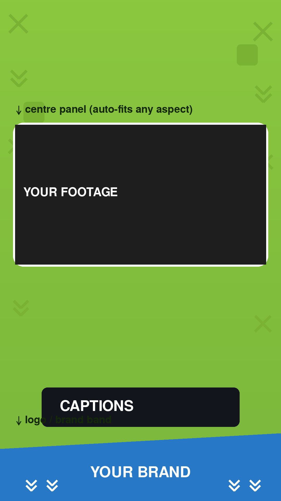

# 🎬 Promo Video Builder

Turn a raw clip into a **styled vertical promo** (1080×1920, Reels / TikTok /
Shorts format): a branded background, your footage in a rounded centre panel,
bold animated captions, a logo band, and a closing call-to-action card.

Upload a video → get a finished promo. Nothing else required.



## What it produces

| Piece | Description |
|-------|-------------|
| Background | Branded green canvas with decorative shapes + bottom logo band |
| Footage panel | Your clip, fitted (any aspect ratio) into a rounded centre panel — no black bars |
| Captions | Bold uppercase text in dark rounded boxes, auto-timed across the clip |
| Outro card | Title + subtitle + CTA button (e.g. "START FREE") for the last few seconds |
| Audio | Keeps the clip's audio; can mix in background music |

Colours, brand name, outro text and CTA all live in
[`config.py`](config.py) (`BrandConfig`) — swap them for your own brand.

## Install

```bash
pip install -r video_promo/requirements.txt
```

`imageio-ffmpeg` ships a static ffmpeg, so you don't need ffmpeg installed
separately. If you already have ffmpeg on your PATH it's used automatically.

## Use it — web upload page

```bash
pip install flask
python -m video_promo.webapp
# open http://localhost:5001
```

Choose a video, optionally type captions / branding, click **Build**. The promo
is rendered and shown for preview + download. (Synchronous build, ~20–40s per
clip — intended for local single-user use.)

## Use it — command line

```bash
# Minimal — just style the clip with placeholder branding
python -m video_promo.cli clip.mp4 -o promo.mp4

# With captions + branding + music
python -m video_promo.cli clip.mp4 -o promo.mp4 \
    --caption "TURN YOUR CLIP" \
    --caption "INTO A POLISHED PROMO" \
    --caption "IN ONE STEP" \
    --brand "MY BRAND" \
    --outro-title "MYAPP" --outro-subtitle "By My Company" \
    --cta "START FREE" --cta-subtext "For iOS and Android" \
    --music track.mp3

# Captions from a file (one line per caption)
python -m video_promo.cli clip.mp4 -o promo.mp4 --captions-file lines.txt
```

Run `python -m video_promo.cli -h` for all options.

## Use it — from Python

```python
from video_promo import BuildConfig, BrandConfig, build

build(BuildConfig(
    input_path="clip.mp4",
    output_path="promo.mp4",
    captions=["LINE ONE", "LINE TWO"],
    brand=BrandConfig(brand_name="MY BRAND", cta_text="START FREE"),
))
```

## How it works

1. **Probe** the clip (size / duration / audio) via OpenCV, falling back to ffmpeg.
2. **Draw** the static assets with Pillow (`style.py`): background, panel mask,
   caption boxes, outro card.
3. **Render** the main segment with ffmpeg: footage scaled into the panel, given
   rounded corners via an alpha mask, composited on the background, with captions
   overlaid on timed windows.
4. **Render** the outro card as its own short segment.
5. **Concatenate** the two into the final MP4.

See [`builder.py`](builder.py) for the ffmpeg orchestration.

## Notes / limits

- Captions are distributed evenly across the clip. For hand-timed captions,
  extend `BuildConfig.captions` handling in `builder._render_main`.
- Auto-transcribed captions (speech → text) aren't built in; add a
  `faster-whisper` step and feed the result into `captions`.
- The web UI builds synchronously and is not hardened for public multi-user use.
